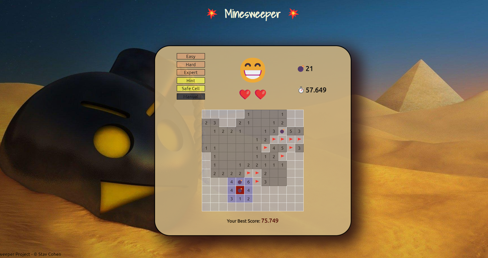
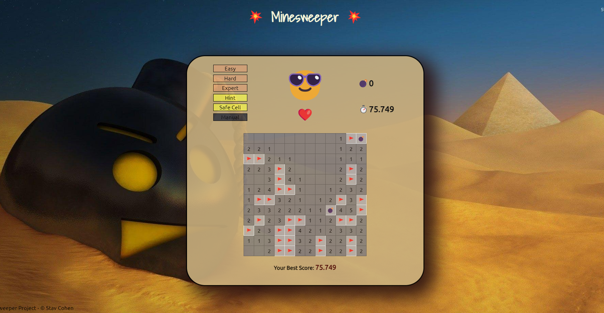
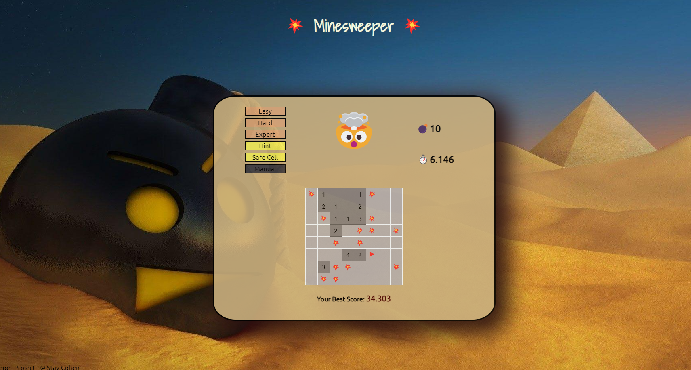

# Minesweeper Game- Vanilla.js

## Description ##
This is my Minesweeper game, built using JavaScript. The game demonstrates my proficiency in vanilla.js development. Utilizing a 2D matrix, it effectively renders the game board and showcases my DOM manipulation skills.

## Key Features ##
**Three Difficulty Levels:** Varying board sizes and mine counts.

**Button Hint Functionality:** Interactive feature revealing neighboring cells.

**Manual Mode Customization:** User-set mine positions for custom challenges.

**Best Time Score:** Stores and displays best times locally.

**Safe Cell Button:** Strategic safe cell revelation and available.

**Extra Lives Feature:** Additional lives in hard and expert levels

*Happy gaming!*

